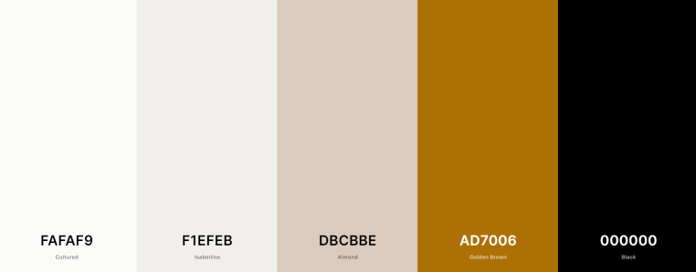
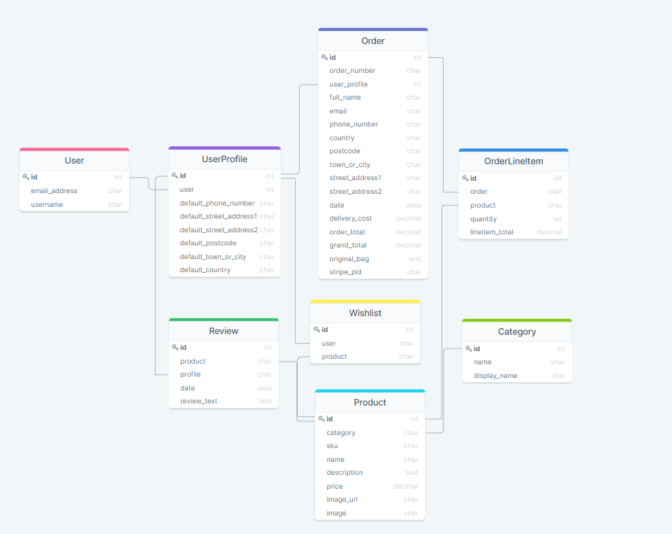

<h1 align="center">goldish</h1>

This is an E-Commerce website that focuses on selling simple and fine gold jewelry for everyday use.
It is designed and developed by Kristina Bogdanovic. For educational purposes only.

## Table of Content

- [User Experience](#user-experience-(ux))
- [Features](#features)
- [Technologies used](#technologies-used)
- [Testing](https://github.com/kristinabog/goldish/blob/main/TESTING.md)
- [Deployment](#deployment)
- [Credits](#credits)

## User Experience (UX)

### User stories

As an user, I want to be able to:
1. See all products listed with pictures and their price, so I can decide what to choose
2. Filter through the products by category, price or name, so I can easily find the right product for me
3. To use a searh query, in order to find a specific product
4. See all the product details and reviews of an individual product, in order to understand if the porduct is worth purchasing
5. To easily select a product to purchase
6. Get real time feedback on my actions on the website
7. View my bag and total costs
8. To update my bag anytime, in order to delete a product or update the quantity of a product
9. Proceed to a secure checkout, in order to make a safe purchase 
10. Receive a confirmation e-mail of my order

As a first time user, I want to be able to:
1. Easily create an account on the website in order to get access to features for registered users

As a returning user, I want to be able to:
1. Easily log in to my account
2. Keep track of all my previous orders, in order to check past orders and retrieve the order number
3. Save default delivery information, in order to make a new order faster
4. Reset my password in case I lost mine
5. Leave a review about a specific product and be able to edit, in case of an error in my text
6. Add products to my wishlist, in order to keep track of products I like
7. View my wishlist and revisit or delete certain products in the list

As a superuser, I want to be able to:
1. Add new products
3. Edit and delete existing products, in order to manage the store at all times
4. Be the only one who can delete reviews, in order to prevent false information in the reviews


### Strategy

The goal of this website is to sell only gold jewerly that are simple and can be worn everyday.
This attracts mainly women who choose to wear this kind of jewerly. The website is built to mainly sell
to clients in Europe as the prices are in Euro and there is no option to choose a county.

### Scope

The scope for this website is mainly women, who can afford more expensive jewelry. 
But also anyone who is looking to buy a nice gift for a woman in their lives.

### Structure

In order for the user to easily navigate through the website the following navigation was applied:

1. User management

    From the home page, clicking on the profile button on the top right hand side you can choose to log in or register.
    Once logged in, the user has access to their own profile: with their details, addresses and purchase history and their wishlist.
    And ofcourse the user is able to select anything on the website to purchase and their bag being untouched for when they return back to the website without continuing to checkout.

2. Product management

    From the home page you can click on 'Discover now' and it will redirect you to all the products listed.
    Top left handside you can enter any query to find a specific product.
    In the navbar you can click on one of the jewerly categories or on all products to get the product sorted by price.
    When clicking on the picture of the prodcut, you can view all the details, price and buttons to add to the bag or wishlist.

3. Transaction management

    In order to make a purchase, you click on your bag in the top right corner which already gives a preview on the price under the icon.
    In the shopping bag you can edit the quantity or delete products.
    When clicked on checkout, you fill in the form and payment details. The contact and shipping information you can save to your profile for future use. Once the payment was accepted you end up on the confirmation page with all the order details and a confirmation e-mail in your inbox. 


### Surface

#### Colour Scheme

The chosen color scheme was chosen to match the gold products and the logo. I have chosen for soft shades of gold.


#### Typography

- The primary font is: Assistant

    Has a clean look and makes it easy to read
- Secondary font is: Lora
    
    Used for logo and titles, gives a indie and classic touch to the website

#### Imagery

- The home page background is a collage of 2 images made on canva.com. As most jewelry websites showcase a model wearing jewerly on the landing page, this was my main reason of doing something similar.

- The product images were all cropped and tinified in order to match with all the other product images. I have always tried to find jewerly with a clean white background.

### Skeleton

Wireframes:
- [Home](media/readme/wf-home.pdf)
- [All Products](media/readme/wf-products.pdf)
- [Product Detail](media/readme/wf-product-detail.pdf)
- [Log In](media/readme/wf-login.pdf)
- [Register](media/readme/wf-register.pdf)
- [Bag](media/readme/wf-bag.pdf)
- [Checkout](media/readme/wf-checkout.pdf)
- [wishlist](media/readme/wf-wishlist.pdf)

## Features

- **Navigation bar**
 
    The navbar is fully responsive on all devices and implemented on every page. 
    It is easy to navigate from any page. Users can also see the current total of their shopping bag under shopping bag icon.
    Search funcionality is also added to the navbar, to easily search for the right product with keywords.

- **Product pages**

    You can view products 4 per row, on smaller screens the amount of product per row decreases. For each product you wil
    find their product name and price. Also users are able to sort products by price, name and category.
    Hovering over the product you will find a view button, which makes it clear for users that clicking on the 
    picture will take them to the individual products page. On the individual products page users can increase
    and decrease the quantity they want to buy, or add them to their wishlist.
    Also users can leave reviews on the products.

- **Toasts**

    User will get updates everytime they do an action on the website, it will appear right top side of the page.

- **Shopping bag**

    User can increase and decrease the quantity of products or delete products. On the right side of the page
    or on mobile screen on the bottom of the page they will see their summary.

- **Checkout page**

    Contains a page where the user can fill in all of their details and select if they want to add the info to their
    profile. Also it contains the payment system of Stripe, where they fill in their card details and get redirected 
    to the payment authorisation of their bank when they click 'Complete Order'.

- **Footer**
    The footer contains quick links to the products pages and links to social media
    Also containing contact information

- **Profile**

    Users can update their profile info and see their order history.

- **Wishlist**

    Users can see all of the prodcuts they have added to their wishlist. 
    Same as on the product pages they can click on the pictures to be redirected to the individual products page.
    Also they can delete products from thier wishlist, clicking on the trash icon next to the product name.

## Information Architecture



Made with [DrawSQL](https://drawsql.app/)

### Databases
- [SQLite:](https://www.sqlite.org/index.html)
    Was mainly used during development
- [Heroku Postgres:](https://www.heroku.com/postgres)
    After deployment this database was used an add-on service of Heroku

## Technologies Used

### Languages Used

-   [HTML5](https://en.wikipedia.org/wiki/HTML5)
-   [CSS3](https://en.wikipedia.org/wiki/Cascading_Style_Sheets)
-   [Javascript](https://en.wikipedia.org/wiki/JavaScript)
-   [Python](https://www.python.org)

### Frameworks, Libraries & Programs Used:

1. [Bootstrap:](https://getbootstrap.com/)
    was used to assist with the responsiveness and styling of the website.
2. [Django](https://www.djangoproject.com/)
     was used as the web framework for the application
3. [Django AllAuth:](https://django-allauth.readthedocs.io/en/latest/index.html)
    was used for user authentication, registration and account management
4. [Django Crispy Forms:](https://django-crispy-forms.readthedocs.io/en/latest/)
    was used to style all the Django forms.
5. [Pillow:](https://pillow.readthedocs.io/en/stable/)
    Was used to add image processing capabilities to the Python interpreter
6. [Django Countries:](https://pypi.org/project/django-countries/)
    was used to provide forms with country choices
7. [Google Fonts:](https://fonts.google.com/)
    was used to import the font-families into the style.css file.
8. [Font Awesome:](https://fontawesome.com/)
    was used to add all the icons found on the website.
9. [Git:](https://git-scm.com/)
    was used for version control. In the terminal of Gitpod, I used Git to add and commit to Git and after pushing it to Github.
10. [GitHub:](https://github.com/)
    is used to store and share my project.
11. [Balsamiq:](https://balsamiq.com/)
    was used to create the wireframes during the design process.
12. [TinyPNG:](https://tinypng.com/)
    was used to compress the images.
13. [Heroku:](https://www.heroku.com) 
    was used to deploy the website.
14. [JQuery:](https://jquery.com/)
    was used for the interactive elements of Bootstrap.
15. [Jinja:](https://jinja.palletsprojects.com/en/2.10.x/)
    was used to simplify and display backend data in the html files.
16. [Stripe:](https://stripe.com/)
    used as the payment system when making an order.
17. [AWS:](https://aws.amazon.com/)
    Amazon Web Services was used to store all the media and static files for the deployed project.
    

## Testing -> [TESTING.md](https://github.com/kristinabog/goldish/blob/main/TESTING.md)


## Deployment

The [Code Institute Template](https://github.com/Code-Institute-Org/gitpod-full-template) was used to develop this project

### Requirements

- [Python](https://www.python.org/)

- [PIP](https://pypi.org/project/pip/)

- [Git](https://git-scm.com/) for project version control

- [AWS](https://aws.amazon.com/) account with a set up S3 Bucket

- [Stripe](https://dashboard.stripe.com/) Account for payment functionality

### Making a local clone

1. Log in to [GitHub](https://github.com/) and navigate yourself to the repository.
2. Click the 'Code' dropdown above the file list.
3. Copy the URL for the repository.
4. Open Git Bash
5. Change the current working directory to where you want the cloned directory.
6. Type git clone in the CLI and then paste the URL you copied earlier.
   It should look like this:
```
$ git clone https://github.com/kristinabog/goldish
```
7. Press enter to create clone

### Local Deployment

1. Install all project requirements with the following command:
```
pip3 install requirements.txt
```
2. Create a `.gitignore` file and an `env.py` or add your variables to gitpod in settings -> variables

3. Do not forget to add `env.py` to your `.gitignore` file, to avoid pushing keys to github

4. Within the `env.py` file or in your gitpod variables, apply the following environment variables:
```
import os

os.environ.setdefault("SECRET_KEY", <your_secret_key>)
os.environ.setdefault("DEVELOPMENT", '1')
os.environ.setdefault("STRIPE_PUBLIC_KEY", <your_key>)
os.environ.setdefault("STRIPE_SECRET_KEY", <your_key>)
os.environ.setdefault("STRIPE_WH_SECRET", <your_key>)
```
5. Apply all database migrations:
```
python3 manage.py makemigrations
```
```
python3 manage.py migrate
```
6. The JSON files contain all the data for the database, you can import them with the following command:
```
python3 manage.py loaddata
```
7. You will need to create a superuser:
```
python3 manage.py createsuperuser
```
8. Run the project with the following command:
```
python3 manage.py runserver
```

### Heroku Deployment

#### Create Heroku App

- In Heroku, create an app with an unique name
- Choose region, click 'Create App'
- Select GitHub as Deployment method. Make sure your GitHub username is displayed
- Type in repo name and click 'search' and then 'connect'

#### Create PostgreSQL Database

1. Navigate to 'Resources'
2. In the search bar, enter 'postgres' and select 'Heroku Postgres'
3. Select a plan and click on 'Submit Order Form'

Configure Database:

Install the following dependancies to use Postgres:
```
pip3 install psycopg2_binary
```
```
pip3 install dj_database_url
```
```
pip3 install gunicorn
```

#### Configure Heroku Variables

1. To set all the necessary variables for the project, navigate to 'Settings' and find the 'Reveal Config Vars' button
Add the following:
```
AWS_ACCESS_KEY_ID =	<Your variable here>
AWS_SECRET_ACCESS_KEY =	<Your variable here>
DATABASE_URL =	<Your Database URL>
DISABLE_COLLECTSTATIC =	1 
EMAIL_HOST_PASS = <Your Email Password>
EMAIL_HOST_USER = <Your Email Address>
SECRET_KEY = <Your variable here>
STRIPE_PUBLIC_KEY = <Your variable here>
STRIPE_SECRET_KEY = <Your variable here>
STRIPE_WH_SECRET = <Your Stripe WH Key>
USE_AWS = True
```
2. Navigate to the 'Deploy tab' and scroll down to 'Automatic Deploys' and select 'Enable Automatic Deploys'

#### Further deployment steps

1. Log in to Heroku CLI:
```
heroku login -i
```
2. Freeze dependancies:
```
$ pip3 freeze > requirements.txt
```
3. Create a Procfile:
```
$ echo web: python app.py > Procfile
```
4. In the `settings.py` file:
    - At the top in the import section add: `import dj_database_url`
    - Replace `DATABASE` variable with the following:
    ```
            if "DATABASE_URL" in os.environ:
            DATABASES = {"default": dj_database_url.parse(os.environ ["DATABASE_URL"])}
        else:
            DATABASES = {
            "default": {
                "ENGINE": "django.db.backends.sqlite3",
                "NAME": BASE_DIR / "db.sqlite3",
            }
        }
    ```
    - Add Heroku to the ALLOWED HOSTS variable:
    ```
    ALLOWED_HOSTS = ['127.0.0.1',
                 '<your heroku app name>.herokuapp.com',
                 'localhost']
    ```
5. Backup the current SQLite database:
```
./manage.py dumpdata --exclude auth.permission --exclude contenttypes > db.json
```
6. Migrate the models to the new Postgres database
```
python manage.py makemigrations
```
```
python manage.py migrate
```
7. Create a new superuser to have access to the Django Admin Page:
```
python3 manage.py createsuperuser
```
8. Reload the data into the new database:
```
./manage.py loaddata db.json
```
9. Temporarily disable collectstatic, until the AWS Bucket is set up. This to prevent Heroku from collecting them:
```
heroku config:set DISABLE_COLLECTSTATIC=1 --app <your app name>
```
10. Push the changes to github:
```
$ git add .
$ git commit -m "Commit Message"
$ git push
```
11. Set up push to heroku:
```
heroku git:remote -a <your heroku app name>
```
12. Push to heroku:
```
git push heroku main
```

In the top-right of the page, click on 'View App', and then you can view your deployed app.


#### AWS S3 Bucket setup

1. Create an account on [AWS](https://aws.amazon.com/)
2. In the search bar input 'S3' and create a new Bucket
    - Give your bucket a name and choose closest region
    - Uncheck Public Access
3. On Bucket Dashboard click on 'Properties' tab
    - Turn on 'Static website hosting'
    - In index and error, enter index.html and error.html and save
4. In the 'Permissions' tab:
Configure the following in CORS:
```
[
     {
          "AllowedHeaders": [
               "Authorization"
          ],
          "AllowedMethods": [
               "GET"
          ],
          "AllowedOrigins": [
               "*"
          ],
          "ExposeHeaders": []
     }
]
```
5. In Bucket Policy, click Generate Policy
- Click Policy > S3 Bucket Policy
- Add * to the Principal Field (selects all principals)
- Set 'Action' to 'Get Object'
- Paste in ARN from previous page
- Click 'Add Statement' and then 'Generate Policy'
- Copy and paste new policy into Bucket Policy
- Add */ to the end of the Resources Key and save
Find Access Control List and set the List Objects Permission to everyone

6. In the Services dropdown list find IAM Dashboard
- Create a new user group
- Create a policy from the Policy tab
- Select Import Managed Policy and S3 Full Access Policy
- In the Resource section, paste the following:
```
[
     arn:aws:s3:::<your-bucket-name>",
     "arn:aws:s3:::<your-bucket-name>/*"
]
```
- Click 'Create Policy'
7. Find the group that you just made
- Under Permissions click Add permissions, choose Attach Policies and select the one just created

8. Find the 'Users tab' and choose a username
- Select Programmatic access as the Access type
- Click Next and add the user to the Group just created
- Click Next and Create User

9. Download the .csv containing the access key and secret access key.
- note: it can only be downloaded once, do not share it with anyone

#### Configure AWS Bucket 

1. In the project CLI, install the following:
```
pip3 install boto3
```
```
pip3 install django-storages
```
2. Freeze new dependancies:
```
$ pip3 freeze > requirements.txt
```
3. Add the values from the .csv you downloaded to your Heroku Config Vars under Settings
3. Delete DISABLE_COLLECTSTATIC variable from your Heroku Config Variables
4. Push your changes


## Credits

### Code

- A lot of code is based on the code of the Boutique Ado tutorial from Code Institute but edited to my liking 
and style of the website.


### Images

home-img - background home:

Put together with [Canva](https://www.canva.com/)

[Left Picture](https://www.pexels.com/photo/side-view-of-a-pretty-woman-wearing-gold-earring-5029244/)

[Right Picture](https://www.pexels.com/photo/side-view-of-a-pretty-woman-wearing-stylish-necklace-and-earring-5029179/)

Product Images:

From [Unsplash](https://unsplash.com/)
- [Necklace-1](https://unsplash.com/photos/ImEzF9B91Mk)
- [Ring-1](https://unsplash.com/photos/Pxexdj3Q09g)

From [Pexels](https://www.pexels.com/)
- [Earrings-1](https://www.pexels.com/nl-nl/foto/hout-strand-zand-structuur-4996905/)

From Google image Search (Commercial filter):
- [Ring-2](https://stock.adobe.com/hu/search/images?k=gold+ruby+ring)
- [Ring-3](https://us.123rf.com/450wm/ukmarkjohnson/ukmarkjohnson2007/ukmarkjohnson200700007/150530621-chocolate-diamond-yellow-gold-ring.jpg?ver=6)
- [Necklace-2](http://www.maisonvanbelle.com/wp-content/uploads/2016/04/hrg12.jpg)
- [Necklace-3](https://us.123rf.com/450wm/phatthanit/phatthanit1608/phatthanit160800066/61490111-gold-chain-necklace-isolated-on-white-background-.jpg?ver=6)
- [Bracelet-1](https://burst.shopifycdn.com/photos/simple-gold-bracelet.jpg?width=925&exif=1&iptc=1)
- [Bracelet-2](https://t4.ftcdn.net/jpg/01/82/64/71/360_F_182647124_6nrP52iC8opc8F3WsEGte3gZtKk1DDSA.jpg)
- [Bracelet-3](https://us.123rf.com/450wm/jandix/jandix2010/jandix201000009/157609618-jewelry-bracelet-gold-finish-stainless-steel-white-color-background.jpg?ver=6)
- [Earrings-2](
https://static.vecteezy.com/system/resources/previews/002/605/906/non_2x/diamond-earring-gold-free-photo.jpg)
- [Earrings-3](
https://us.123rf.com/450wm/radub85/radub851606/radub85160600104/58075774-gold-earrings-with-pearl-on-white.jpg?ver=6)
- [No Image](https://us.123rf.com/450wm/surfupvector/surfupvector1908/surfupvector190802662/129243509-denied-art-line-icon-censorship-no-photo-no-image-available-reject-or-cancel-concept-vector-illustra.jpg?ver=6)

### Acknowledgements
- My Mentor for the helpful feedback.

- A very huge thank you to the Tutor support who helped me solve bugs.

- A thank you to family and friends that took the time to test the website.

